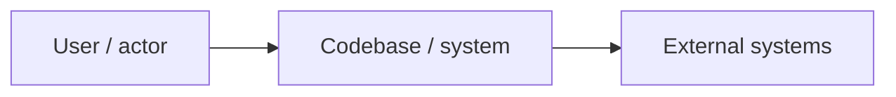
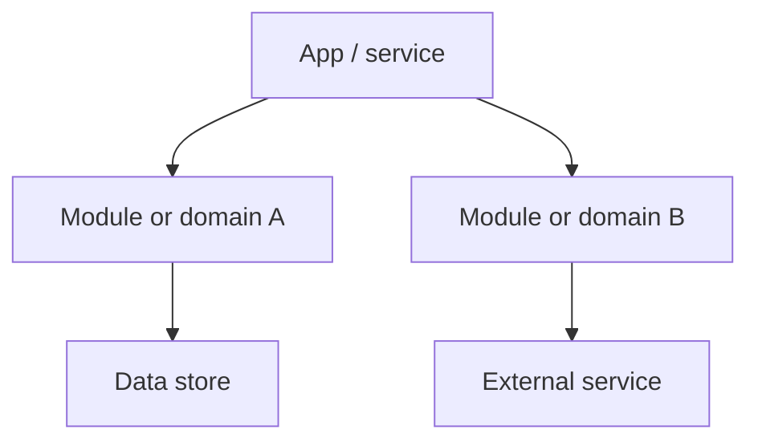

Create or update `ARCHITECTURE-REVIEW.md` in the repository root as a comprehensive but non-verbose architecture review.

The goal is to help a developer or tech lead quickly understand the architecture style, design approach, main patterns, system boundaries, and architecture risks. Keep the review concise, factual, and based on code/config evidence. Do not go deep into individual API endpoints.

Use this workflow:

1. Inspect architecture sources of truth.
   - Read README, docs, architecture notes, ADRs, deployment docs, infrastructure docs, diagrams, and setup docs if present.
   - Read existing overview files such as `WHATS-UP.md`, `BE-REQUEST-FLOW.md`, `BE-ACM.md`, `CODE-QUALITY-GUARDS.md`, or `MAKES-NO-SENSE.md` if present, then verify against code.
   - Inspect package/build config, workspace config, infrastructure files, service folders, app entrypoints, route roots, domain folders, modules, packages, workers, queues, jobs, database/migration files, and external integration adapters.
   - Use `rg` and targeted file reads to identify architecture terms such as `domain`, `module`, `service`, `repository`, `adapter`, `port`, `event`, `command`, `query`, `handler`, `facade`, `factory`, `builder`, `state`, `strategy`, `middleware`, `usecase`, `controller`, `entity`, `aggregate`, `saga`, `workflow`, and `orchestrator`.

2. Identify the architecture shape.
   - Classify the codebase as one or more of: monolith, modular monolith, microservices, serverless, event-driven, layered app, hexagonal/ports-and-adapters, frontend-only, library/package, data pipeline, or mixed/unclear.
   - Identify deployment/runtime containers at a high level, such as web app, API service, worker, queue, database, cache, object storage, third-party provider, or cron/scheduler.
   - Identify module/domain boundaries and whether they are enforced by code, packages, facades, lint rules, imports, or only folder naming.

3. Identify design style and patterns.
   - Look for DDD concepts: domains, entities, aggregates, value objects, repositories, domain services, application services, events, bounded contexts, facades, or anti-corruption layers.
   - Look for event-driven concepts: producers, consumers, queues, topics, retries, DLQs, idempotency, sagas, orchestration, choreography, rollback/compensation, and durability.
   - Look for common patterns: factory, adapter, facade, builder, strategy, state, repository, unit of work, command, query, observer/pub-sub, middleware, dependency injection, service locator, and mapper.
   - If no clear design patterns are visible, state `No clear patterns found` and list that as an architecture gap.

4. Review architecture fit.
   - If modular monolith: check domain boundaries, cross-domain imports, shared module pressure, facades, internal APIs, and whether modules reach into each other.
   - If microservices: check service ownership, contracts, network boundaries, data ownership, observability, versioning, and failure isolation.
   - If event-driven: check retries, DLQ/durability, idempotency, ordering, saga/compensation handling, and multi-step transaction behavior.
   - If serverless: check function boundaries, cold-start risk, IAM/config boundaries, async triggers, retries, DLQs, and shared code packaging.
   - If layered architecture: check controller/service/repository boundaries, business logic placement, transaction handling, and dependency direction.
   - If DDD-like: check bounded contexts, domain language, repository boundaries, application vs domain service split, and anti-corruption around external systems.
   - If frontend-heavy: check state boundaries, data-fetching boundaries, route/module boundaries, design-system boundaries, and client/server split.

5. Create `ARCHITECTURE-REVIEW.md` using exactly this structure:

````markdown
# Architecture Review

## 1. Overview

### Architecture Shape

- [Line 1: monolith/modular monolith/microservices/serverless/etc. and why.]
- [Line 2: main runtime/container shape.]
- [Line 3: main boundary or deployment implication.]

### Design Style

- [Line 1: DDD/event-driven/layered/hexagonal/etc. signal, or "No clear design style found".]
- [Line 2: how modules/domains/workflows are organized.]
- [Line 3: biggest design-style gap or strength.]

### Design Patterns

- [Line 1: strongest visible patterns, or "No clear patterns found".]
- [Line 2: where those patterns appear.]
- [Line 3: missing or weak pattern that would help later.]

## Architecture Diagrams

### System Context



### Container / Domain View



## 2. Review

### What Works

- [One-line architecture strength.]
- [One-line architecture strength.]
- [One-line architecture strength.]

### Main Risks

- [One-line architecture risk.]
- [One-line architecture risk.]
- [One-line architecture risk.]

### Boundary Review

- Module/domain boundaries: [one-line finding.]
- Dependency direction: [one-line finding.]
- Shared code pressure: [one-line finding.]
- Facades/adapters: [one-line finding.]

### Workflow Review

- Sync flows: [one-line finding.]
- Async/event flows: [one-line finding, or "Not evident from repo".]
- Multi-step transactions: [saga/rollback/compensation finding, or "Not evident from repo".]
- Retry/durability: [one-line finding, or "Not evident from repo".]

### Pattern Review

- Patterns used well: [short list, or "Not evident from repo".]
- Patterns missing or weak: [short list, or "Not evident from repo".]
- Pattern inconsistency: [one-line finding, or "Not evident from repo".]

## Evidence

| Claim | Evidence | Confidence |
| --- | --- | --- |
| [architecture/design/pattern claim] | `[file path]`, `[file path]` | `High|Medium|Low` |

## Analysis

- Architecture classification: [one line.]
- Biggest architecture strength: [one line.]
- Biggest architecture gap: [one line.]
- Best next review: [one line, not a detailed solution plan.]
````

6. Output requirements.
   - Keep the overview sections to exactly 3 bullets each.
   - Include exactly two Mermaid diagrams: `System Context` and `Container / Domain View`.
   - Keep diagrams high-level; do not list every API endpoint.
   - Use conservative Mermaid syntax that is likely to render.
   - Use exact file paths, folder names, package names, service names, queue names, domain names, and pattern names from the repo.
   - Add architecture-specific review bullets only when relevant to the observed architecture.
   - If architecture style, design style, or patterns are unclear, say so directly and list it as a gap.
   - Do not include setup instructions, command output dumps, endpoint inventories, or change history.
   - Do not modify application code.

7. Style requirements.
   - Be comprehensive but non-verbose.
   - Use bullets and tables over paragraphs.
   - Use simple words and low jargon.
   - Prefer evidence over speculation.
   - Avoid broad architecture essays.
   - Avoid solutioning beyond one-line improvement signals.

8. Verification and final response.
   - Read back `ARCHITECTURE-REVIEW.md` before finalizing.
   - For docs-only edits, tests are not required unless the repo has a docs or Mermaid validation command.
   - In the final response, link to `ARCHITECTURE-REVIEW.md`, summarize the architecture classification, design style, strongest pattern signal, and any uncertainty caused by missing architecture evidence.
