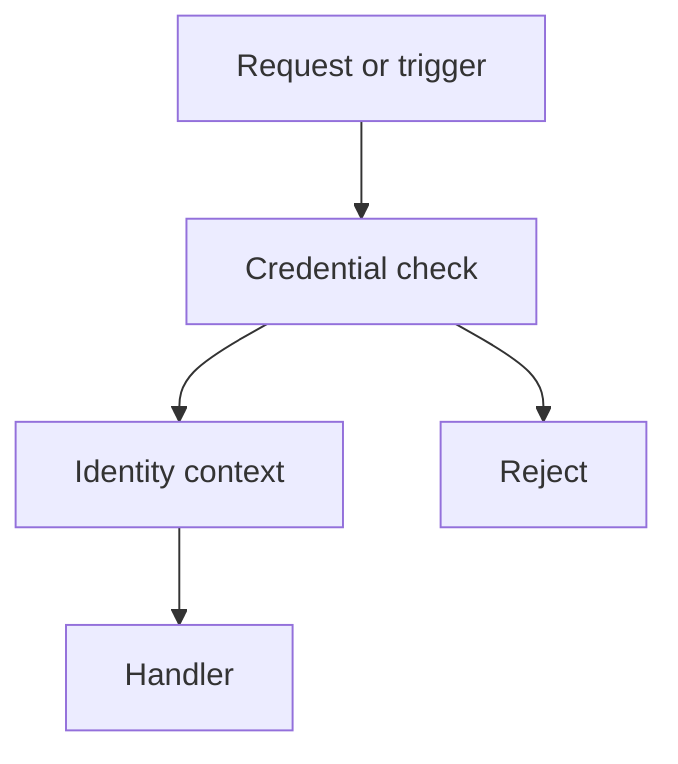
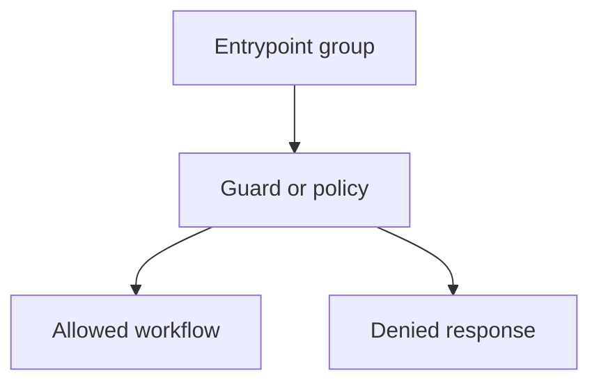

Create or update `BE-ACM.md` in the repository root as a lightweight backend access-control map.

The goal is fast onboarding for a new developer. Explain how authentication and authorization work, if they exist. Keep the document concise, concrete, and non-verbose. Use simple words. Do not invent auth behavior that is not visible in code or config.

Use this workflow:

1. Inspect the backend access-control source of truth before writing.
   - Read `BE-REQUEST-FLOW.md` if it exists, then verify against code.
   - Read README, docs, deployment notes, API docs, and security docs if present.
   - Inspect routing files, server/bootstrap files, middleware, guards, policies, decorators, route groups, framework config, lambda/worker handlers, API gateway config, queue/consumer config, cron jobs, and CLI entrypoints.
   - Search for auth terms such as `auth`, `login`, `session`, `jwt`, `token`, `cookie`, `apiKey`, `apikey`, `oauth`, `oidc`, `role`, `permission`, `policy`, `guard`, `acl`, `rbac`, `tenant`, `owner`, `admin`, and `public`.
   - Check dependencies and environment variable names for auth providers or token validation libraries.

2. Classify every backend entrypoint.
   - Treat an entrypoint as any HTTP endpoint, RPC operation, webhook, serverless handler, queue consumer, scheduled job, message poller, event listener, background worker, or CLI command that starts backend work.
   - Mark each entrypoint as `Public`, `Authenticated`, `Role-gated`, `Owner-gated`, `Internal`, or `Unknown`.
   - If an entrypoint is protected by infrastructure outside the repo, mark it `Unknown` unless the repo clearly documents or configures that protection.
   - Do not treat CORS as authentication or authorization unless server-side code actually uses it to block work.

3. Trace authentication.
   - Identify how identity is established, such as session cookie, JWT, API key, OAuth/OIDC provider, signed webhook, platform IAM, or no auth.
   - Identify where credentials are parsed and validated.
   - Identify where the user/service identity is attached to request context.
   - Identify failure behavior, such as `401`, redirect, rejected message, skipped job, or uncaught error.
   - If no authentication is found, say that directly.

4. Trace authorization.
   - Identify roles, permissions, ownership checks, tenant checks, service-only checks, admin checks, feature flags, or policy rules.
   - Explain what each role or access level can do.
   - Group entrypoints that share the same guard or policy.
   - Keep explanations short; focus on what blocks or allows the operation.

5. Create `BE-ACM.md` using exactly this structure:

````markdown
# Backend Access Control Map

## Endpoint Access Summary

- `[METHOD /path]` - `Public|Authenticated|Role-gated|Owner-gated|Internal|Unknown`; [one-line purpose or guard note]. Source: `[file path]`
- `[Trigger name]` - `Public|Authenticated|Role-gated|Owner-gated|Internal|Unknown`; [one-line purpose or guard note]. Source: `[file path]`

## Authentication

- Auth method: [short statement, or "Not evident from repo".]
- Credential source: [cookie/header/token/provider/signature/IAM/etc., or "Not evident from repo".]
- Validation point: `[file path or function]`, or `Not evident from repo`.
- Request identity: [where user/service identity is stored, or "Not evident from repo".]
- Failure behavior: [401/403/redirect/drop/retry/etc., or "Not evident from repo".]



## Authorization

### Roles And Access

- `[role or access level]` - [one-line access summary.]
- `No explicit roles found` - [use this only if true.]

### Entrypoint Guards

#### [Guard or policy name]

- Entrypoints: `[entrypoint]`, `[entrypoint]`
- Allows: [one-line rule.]
- Denies: [one-line rule.]
- Source: `[file path]`



## Analysis

- [One-line improvement, risk, or gap.]
- [One-line improvement, risk, or gap.]
- [One-line improvement, risk, or gap.]
````

6. Output requirements.
   - Include every discovered backend entrypoint in `Endpoint Access Summary`.
   - Keep each endpoint summary to one line.
   - Keep authentication bullets short and factual.
   - Include one short Mermaid diagram in `Authentication`.
   - Include one short Mermaid diagram per `Entrypoint Guards` group.
   - Group entrypoints only when they share the same guard or policy.
   - If auth or roles are absent, make that clear instead of forcing a fake model.
   - If access is unclear from the repo, use `Unknown` and name what evidence is missing.
   - Use source file paths so readers can jump into code.

7. Style requirements.
   - Be concise over complete prose.
   - Use exact route names, handler names, middleware names, guard names, role names, and policy names from the repo.
   - Use simple Mermaid labels.
   - Avoid broad security advice.
   - Avoid speculative claims.
   - Do not include setup instructions, test logs, or change history.

8. Verification and final response.
   - Read back `BE-ACM.md` before finalizing.
   - For docs-only edits, tests are not required unless the repo has a docs or Mermaid validation command.
   - In the final response, link to `BE-ACM.md`, summarize the number of entrypoints and guard groups documented, and mention any auth or role uncertainty that remains.
