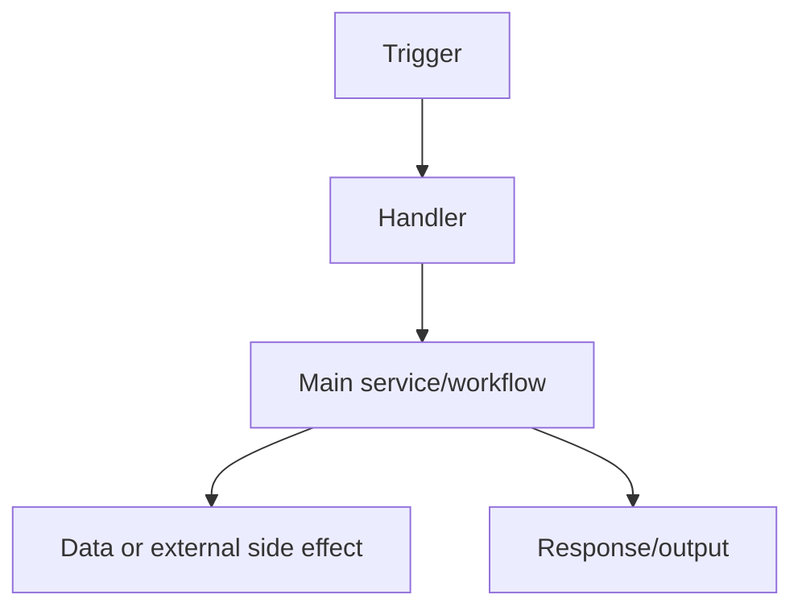

Create or update `BE-REQUEST-FLOW.md` in the repository root as a concise map of every backend entrypoint and its control flow.

The goal is fast backend orientation for a new developer. Keep the document short, concrete, and easy to scan. Use simple words. Avoid long explanations, broad architecture essays, and unnecessary jargon.

Use this workflow:

1. Inspect the backend source of truth before writing.
   - Read the README, product docs, deployment docs, and architecture docs if present.
   - Inspect package/config files, infrastructure files, routing files, server/bootstrap files, worker files, function handlers, queue/consumer setup, cron/scheduler setup, webhook handlers, and background job definitions.
   - Use `rg` or targeted file reads to find all code paths that start backend work.
   - Do not rely only on docs; verify entrypoints in code or runtime config where possible.

2. Treat an entrypoint as anything that can start server-side work, including:
   - HTTP API routes, REST handlers, GraphQL operations, tRPC/RPC procedures, WebSocket/SSE handlers, and webhook handlers.
   - Serverless functions, lambda handlers, edge/worker fetch handlers, and framework route handlers.
   - Queue consumers, pub/sub subscribers, message polling loops, event listeners, background workers, scheduled jobs, cron jobs, and task runners.
   - CLI commands or scripts that run backend workflows.
   - Any framework-specific equivalent that starts a backend operation.

3. For each entrypoint, trace the main control flow.
   - Follow the path from trigger to handler, service layer, data access, external services, side effects, and response/output.
   - Prefer the real code path over idealized design.
   - Include only the important branches in diagrams. Skip tiny helper calls.
   - If a flow is unclear, state the uncertainty briefly instead of guessing.

4. Create a compact `BE-REQUEST-FLOW.md` using exactly this structure:

````markdown
# Backend Request Flow

## App Overview

- [One concise line about what the backend/server does.]
- [One concise line about the main runtime/framework/deployment shape.]
- [One concise line about the main data stores, queues, or external services, if present.]

## Entrypoints

- `[METHOD /path]` - [One-line purpose.] Source: `[file path]`
- `[Trigger name]` - [One-line purpose.] Source: `[file path]`

## Flow Diagrams

### [Entrypoint name]



- [Most crucial thing to know about this flow.]
- [Most crucial dependency, side effect, or failure point.]
- [Most crucial auth, data, queue, latency, or ownership note.]

## Analysis Summary

- Highest traffic entrypoints: [short list, or "Not evident from repo".]
- Most spike-prone entrypoints: [short list, or "Not evident from repo".]
- Most long-running entrypoints: [short list, or "Not evident from repo".]
- Most side-effect-heavy entrypoints: [short list, or "Not evident from repo".]
- Most operationally sensitive entrypoints: [short list, or "Not evident from repo".]
````

5. Output requirements.
   - Include every discovered backend entrypoint in `Entrypoints`.
   - Add one `Flow Diagrams` subsection for every entrypoint.
   - Each flow subsection must contain exactly one Mermaid diagram and exactly 3 bullets.
   - Keep entrypoint bullets to one line each.
   - Keep Mermaid diagrams small enough to read quickly.
   - Use source file paths for entrypoints so readers can jump into code.
   - If many similar routes share the same flow, you may group them only when they truly use the same handler/workflow. Make the grouping explicit.
   - If traffic or runtime patterns are not visible from code, say `Not evident from repo`; do not invent metrics.

6. Style requirements.
   - Be concise over complete prose.
   - Use simple labels in diagrams.
   - Prefer exact route names, handler names, queue names, cron names, and service names from the repo.
   - Avoid marketing language.
   - Avoid speculative claims.
   - Do not include setup instructions, test logs, or a change history.

7. Verification and final response.
   - Read back `BE-REQUEST-FLOW.md` before finalizing.
   - For docs-only edits, tests are not required unless the repo has a docs or Mermaid validation command.
   - In the final response, link to `BE-REQUEST-FLOW.md`, summarize the number of entrypoints documented, and mention any uncertainty that remains.
