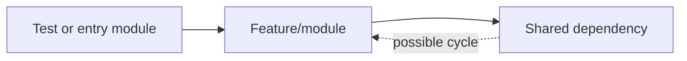

Create or update `CYCLIC-DEPS.md` in the repository root as a short review of cyclic dependencies and test tangling risk.

The goal is to check whether imports, module boundaries, or test helpers create cycles that make tests slower, flaky, hard to isolate, or order-dependent. This is especially common in Node.js/TypeScript projects, but apply the same idea to any language in the repo.

Keep the document concise and practical. Do not add new dependencies or modify application code. Use existing repo tools when available; otherwise use lightweight static inspection.

Use this workflow:

1. Inspect project structure and tooling.
   - Read README, CONTRIBUTING, docs, and architecture notes if present.
   - Inspect package/build files such as `package.json`, `pnpm-workspace.yaml`, `tsconfig*.json`, `vite.config.*`, `jest.config.*`, `vitest.config.*`, `eslint.config.*`, `.eslintrc*`, `pyproject.toml`, `go.mod`, `Cargo.toml`, `pom.xml`, or equivalent.
   - Look for existing cycle tools or rules: `madge`, `dependency-cruiser`, `dpdm`, `eslint-plugin-import`, `import/no-cycle`, `knip`, `ts-prune`, `go list`, or language-specific dependency analyzers.
   - Look for test setup files, shared fixtures, mocks, barrels, and global test helpers.

2. Run available checks only if they already exist.
   - Prefer repo scripts such as `lint`, `test`, `typecheck`, `depcruise`, `madge`, `cycles`, or similar.
   - If a cycle-check tool is present but no script exists, run it only if it is already installed in the repo's dependencies.
   - Do not install new packages.
   - If no tool exists, use `rg` and targeted file reads to inspect imports manually.

3. Review cycle-prone patterns.
   - Check barrel files like `index.ts`, `index.js`, or package exports that re-export many modules.
   - Check cross-layer imports, such as UI importing server code, services importing route handlers, domain code importing tests, or shared utilities importing feature modules.
   - Check test files importing from broad app entrypoints instead of narrow modules.
   - Check mocks and test helpers that import production modules which import the tests/helpers back indirectly.
   - Check path aliases that hide cross-package or cross-layer imports.
   - Check side-effect imports and global setup files that pull in large app graphs.

4. Create `CYCLIC-DEPS.md` using exactly this structure:

````markdown
# Cyclic Dependency Review

## Snapshot

- Cycle check tooling: [tool/script, or "Not evident from repo".]
- Cycles found: [count or "Not checked by tool".]
- Test tangling risk: `Low|Medium|High|Unknown` - [one-line reason.]
- Main risk area: [folder/file/pattern, or "Not evident from repo".]

## Checks Run

| Check | Result | Evidence |
| --- | --- | --- |
| Existing cycle tool/script | [result or "None found"] | `[files/scripts]` |
| Import/layer scan | [result] | `[folders/files]` |
| Test import scan | [result] | `[folders/files]` |
| Barrel/export scan | [result] | `[folders/files]` |

## Possible Cycles Or Tangled Imports

| Area | Pattern | Test impact | Evidence | Severity |
| --- | --- | --- | --- | --- |
| `[file/folder]` | [one-line pattern] | [one-line test impact] | `[file path]` | `Low|Medium|High|Unknown` |

## Test Tangling Notes

- [One-line note about tests importing too much app code, or "Not evident from repo".]
- [One-line note about shared setup/mocks/fixtures, or "Not evident from repo".]
- [One-line note about order/flakiness/slow startup risk, or "Not evident from repo".]

## Import Shape



## Analysis

- Strongest signal: [one-line finding.]
- Biggest risk: [one-line finding.]
- Best next check: [one-line next check, not a detailed plan.]
````

5. Output requirements.
   - Keep the table and bullets short.
   - If no cycles are found, say that clearly and still list the checks performed.
   - If no automated tool exists, say `Not checked by tool` and summarize manual evidence.
   - Use exact file paths, script names, package names, and config names from the repo.
   - Include the Mermaid diagram only if it helps explain a cycle or suspected tangle. Remove `Import Shape` if it would be generic filler.
   - Do not include full command output dumps.
   - Do not write detailed refactor plans.
   - Do not modify application code.

6. Style requirements.
   - Be concise over complete prose.
   - Use simple words and low jargon.
   - Prefer evidence over speculation.
   - Avoid broad best-practice essays.
   - Avoid blaming authors.
   - Do not include setup instructions or change history.

7. Verification and final response.
   - Read back `CYCLIC-DEPS.md` before finalizing.
   - For docs-only edits, tests are not required unless the repo has a docs validation command.
   - In the final response, link to `CYCLIC-DEPS.md`, summarize whether cycles were found, test tangling risk, and any limits caused by missing cycle tooling.
