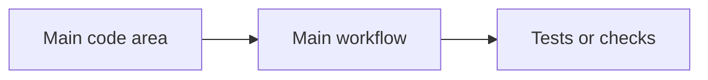

Create or update `WHATS-UP.md` in the repository root as a concise snapshot of how this codebase is currently built and changed.

The goal is to help a new developer quickly understand the repo's real conventions, current contribution habits, tech stack, quirks, and inconsistencies. This is not a best-practices review. Describe what is true today, whether good or bad.

Keep the document lightweight and non-verbose. Use short factual bullets, simple words, small code examples, and Mermaid only when it reduces text. Do not invent conventions that are not visible in code or git history.

Use this workflow:

1. Inspect the repo shape and source of truth.
   - Read README, CONTRIBUTING, docs, architecture notes, setup docs, and development docs if present.
   - Inspect package/build/config files for stack and tooling.
   - Inspect the main source folders and representative files from each major area.
   - Search for repeated patterns with `rg`: imports, naming, error handling, logging, tests, components, API calls, data access, state management, validation, environment config, TODOs, and suppressions.

2. Inspect recent git history.
   - Review the last 50 commits. If fewer than 50 commits exist, review all available commits.
   - Use commands like:

```bash
git log -50 --date=short --pretty=format:'%h%x09%ad%x09%an%x09%s'
git log -50 --name-only --pretty=format:'--- %h %ad %an %s' --date=short
git log -50 --numstat --pretty=format:'--- %h %ad %an %s' --date=short
```

   - Identify recent themes, active areas, frequently touched files, and contributor patterns.
   - If needed, inspect representative commits with `git show --stat <sha>` or targeted `git show <sha> -- <path>`.
   - Do not infer personality, skill, or performance. Only describe observable habits such as commit size, touched areas, test/docs updates, migration work, refactors, or fix-heavy work.

3. Identify current conventions.
   - Capture naming, file layout, module boundaries, import style, component/function style, error handling, logging, validation, data access, state management, testing style, and docs style where relevant.
   - Note whether conventions are consistent, mixed, legacy, or unclear.
   - Find duplicate libraries or patterns that solve the same job.
   - Include tiny code examples when they explain a convention faster than prose.

4. Create `WHATS-UP.md` using exactly this structure:

````markdown
# What's Up

## Snapshot

- Stack: [short list of main languages/frameworks/tools.]
- App shape: [one-line repo/product shape.]
- Current motion: [one-line summary from recent commits.]
- Main convention: [one-line strongest visible convention.]
- Main inconsistency: [one-line biggest visible mismatch.]

## Tech Stack

| Area | Current choice | Evidence | Notes |
| --- | --- | --- | --- |
| Runtime / language | [choice] | `[file path]` | [short note] |
| App framework | [choice] | `[file path]` | [short note] |
| Data / storage | [choice or "None evident"] | `[file path]` | [short note] |
| Testing | [choice or "None evident"] | `[file path]` | [short note] |
| Build / tooling | [choice] | `[file path]` | [short note] |

## Recent Git Activity

- Range reviewed: last [n] commits, [oldest date] to [newest date].
- Main themes: [short comma-separated list.]
- Hot areas: [short comma-separated list of folders/files.]
- Active contributors: [names from git history with one short focus note each.]
- Commit style: [short note on message/size/reviewable shape.]

## Current Practices

| Practice | What happens now | Evidence |
| --- | --- | --- |
| File organization | [one-line current pattern] | `[file path]` |
| Naming | [one-line current pattern] | `[file path]` |
| Error handling | [one-line current pattern] | `[file path]` |
| Logging / observability | [one-line current pattern] | `[file path]` |
| Tests | [one-line current pattern] | `[file path]` |
| Docs | [one-line current pattern] | `[file path]` |
| Recent contribution flow | [one-line pattern from git history] | `git log -50` |

## Coding Conventions

### Consistent

- [One-line convention.]

```text
[Tiny code example or file-shape example.]
```

### Mixed Or Inconsistent

- [One-line inconsistency.]

```text
[Tiny contrasting examples.]
```

## Duplicate Or Competing Patterns

| Purpose | Patterns or libraries | Where | Why it matters |
| --- | --- | --- | --- |
| [purpose] | [pattern A vs pattern B] | `[file path]`, `[file path]` | [one-line impact] |

## Quirks To Know

- [Short practical repo quirk.]
- [Short practical repo quirk.]
- [Short practical repo quirk.]

## Optional Map



## Analysis

- [Most important convention to follow, one line.]
- [Most confusing inconsistency, one line.]
- [Most useful cleanup or documentation improvement, one line.]
````

5. Output requirements.
   - Keep every section short.
   - Use source file paths and git evidence so readers can verify claims.
   - Include code examples only when they reduce explanation; keep each example under 12 lines.
   - Remove `Optional Map` entirely if a Mermaid diagram would not help.
   - Keep `Active contributors` factual and based only on git history.
   - If a convention is not evident, write `Not evident from repo`.
   - If multiple packages or apps have different conventions, call that out directly.
   - Do not turn this into a quality audit. Use `CODE-QUALITY-GUARDS.md` for quality guard analysis if it exists.

6. Style requirements.
   - Be concise over complete prose.
   - Use simple words and low jargon.
   - Prefer examples and tables over paragraphs.
   - Avoid broad best-practice advice.
   - Avoid judging contributors or code quality.
   - Do not include command output dumps, setup instructions, or change history.
   - Do not modify application code.

7. Verification and final response.
   - Read back `WHATS-UP.md` before finalizing.
   - For docs-only edits, tests are not required unless the repo has a docs validation command.
   - In the final response, link to `WHATS-UP.md`, summarize the main conventions found, the last-50-commit range reviewed, and any uncertainty caused by missing evidence.
