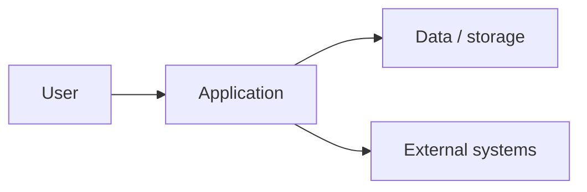
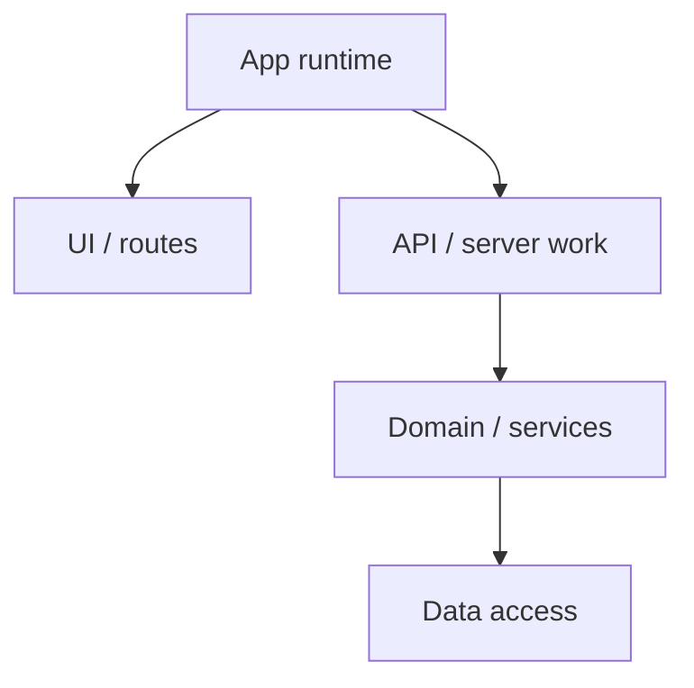

Create or replace `ARCHITECTURE_OVERVIEW.md` as a concise architecture overview for the take-home codebase.

The goal is to understand system shape, boundaries, runtime pieces, data flow, and architecture risks before making fixes.

Do not modify application code in this prompt.

Use this workflow:

1. Inspect architecture sources.
   - Read README, docs, package/workspace config, app entrypoints, route roots, server/bootstrap files, database/migration files, infrastructure files, and integration adapters.
   - Identify frontend/backend split, modules/domains, data stores, external systems, jobs/queues/crons, and test boundaries.
   - Verify with code paths, not docs alone.

2. Classify the architecture.
   - Use simple labels: frontend-only, full-stack monolith, modular monolith, microservices, serverless, event-driven, library/package, or mixed/unclear.
   - Identify boundary enforcement: packages, folders, imports, lint rules, framework conventions, or none.
   - Note only risks relevant to fixing assessment issues.

3. Create `ARCHITECTURE_OVERVIEW.md` using this structure:

```markdown
# Architecture Overview

## Snapshot

- Architecture shape: [classification and why.]
- Runtime pieces: [web app/API/worker/db/etc.]
- Main boundaries: [modules/packages/routes/services.]
- Data stores: [short list or "Not evident."]
- External systems: [short list or "Not evident."]

## System Context



## Container / Module View



## Boundary Review

| Boundary | Evidence | Notes / risk |
| --- | --- | --- |
| [boundary] | `[file/path]` | [one-line note] |

## Important Flows

| Flow | Starts at | Goes through | Ends at | Risk |
| --- | --- | --- | --- | --- |
| [flow] | `[path]` | `[path]` | `[path/external]` | [one-line risk] |

## Architecture Risks For Fixes

- [Risk and why it matters.]
- [Risk and why it matters.]

## Evidence Reviewed

- `[file/path]`
```

4. Output requirements.
   - Keep diagrams high-level.
   - Use exact paths and names from the repo.
   - State uncertainty directly.
   - Avoid broad architecture essays.

5. Final response.
   - Link to `ARCHITECTURE_OVERVIEW.md`.
   - State architecture classification and main risk.
