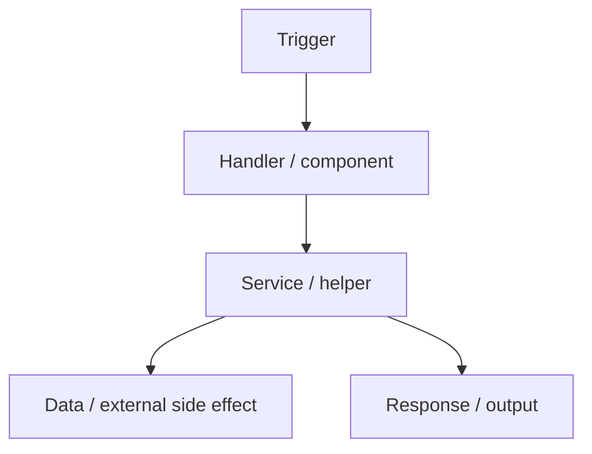

Create or replace `ENTRYPOINTS_FLOW.md` as a concise map of application entrypoints and control/data flow.

The goal is to know where work starts and how requests/actions move through the system before diagnosing issues.

Do not modify application code in this prompt.

Use this workflow:

1. Find entrypoints.
   - Inspect route files, page roots, server/API handlers, middleware, actions, jobs, queue consumers, cron tasks, webhooks, CLI scripts, and test/demo scripts.
   - Treat frontend routes and user actions as entrypoints when the repo is frontend-heavy.
   - Treat backend routes, RPC methods, workers, and scripts as entrypoints when server-side work exists.

2. Trace important flows.
   - Follow trigger to handler/component to service/helper to data/external side effect to response/output.
   - Keep diagrams small.
   - If many routes share a flow, group them only when they truly share the same handler/workflow.

3. Create `ENTRYPOINTS_FLOW.md` using this structure:

```markdown
# Entrypoints And Flow

## App Overview

- [One line about what starts work in this app.]
- [One line about frontend/backend/runtime shape.]
- [One line about key data or external dependencies.]

## Entrypoints

| Entrypoint | Type | Purpose | Source |
| --- | --- | --- | --- |
| `[route/action/script/job]` | UI / API / Worker / Script / Other | [one-line purpose] | `[file/path]` |

## Flow Diagrams

### [Flow Name]



- Key dependency: [one-line.]
- Key failure point: [one-line.]
- Fix caution: [one-line.]

## Sensitivity Summary

- Most user-visible flows: [short list.]
- Most side-effect-heavy flows: [short list or "Not evident."]
- Most security-sensitive flows: [short list or "Not evident."]
- Most performance-sensitive flows: [short list or "Not evident."]
- Most testable flows: [short list.]
```

4. Output requirements.
   - Include every important discovered entrypoint.
   - Use exact paths, routes, handler names, job names, and scripts.
   - State uncertainty directly.
   - Do not inventory tiny helpers.

5. Final response.
   - Link to `ENTRYPOINTS_FLOW.md`.
   - State the number of entrypoints mapped and the riskiest flow.
