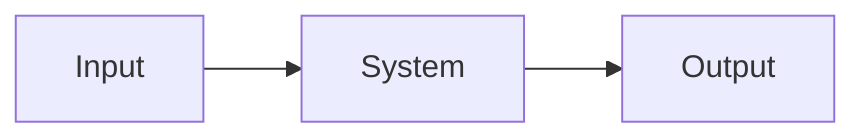

Create `ARCHITECTURES.md`, a compact system-design recap for a user-selected domain.

Start by asking the user:

```text
What domain should the architecture recap cover?
```

The user may answer with any free text, such as `frontend`, `AI-driven frontend`, `backend systems`, `distributed databases`, `developer tools`, or another domain. If the user already provided the domain in the same request, do not ask again; proceed with that domain.

After the domain is known, replace or create `ARCHITECTURES.md`.

Output requirements:

- Generate exactly 100 numbered architecture sections.
- Each section must have:
  - A short title.
  - A one-line overview.
  - One syntax-correct Mermaid diagram.
  - A `Critical decisions` block with exactly 3 concise lines.
- Keep the document dense and practical. The goal is fast exposure to many designs, not a textbook.
- Cover a wide range of patterns, tradeoffs, scales, failure modes, data flows, integration styles, and operational concerns relevant to the chosen domain.
- Prefer concrete architecture names over generic labels.
- Avoid repeating the same design with minor wording changes.

Mermaid requirements:

- Use fenced Mermaid blocks: <code>```mermaid</code>.
- Prefer conservative Mermaid syntax that renders reliably.
- Use simple node IDs, quoted labels when helpful, and valid arrows.
- Use varied diagram types when useful, such as `flowchart`, `sequenceDiagram`, `stateDiagram-v2`, `classDiagram`, `erDiagram`, and `C4Context`.
- Do not include Mermaid syntax that is likely to break because of unescaped special characters.
- Before finishing, review the diagrams for obvious Mermaid syntax errors.

Critical decision requirements:

- Write exactly 3 short lines per section.
- Each line should explain a meaningful decision or tradeoff.
- Include domain-specific choices where relevant, such as SQL vs NoSQL, sync vs async, monolith vs services, cache placement, consistency model, eventing pattern, deployment boundary, UX latency tradeoff, model orchestration, data ownership, or observability strategy.
- Do not write generic filler like "ensure scalability" unless tied to a specific design choice.

Use this structure:

````markdown
# Architecture Recap: [Domain]

100 compact architecture patterns for quickly building system-design fluency in [domain].

## 1. [Architecture Title]

[One-line overview.]



Critical decisions:
- [Decision/tradeoff 1.]
- [Decision/tradeoff 2.]
- [Decision/tradeoff 3.]
````

Continue the same format through section 100.

After writing `ARCHITECTURES.md`, stop and report the file path plus any validation performed.
