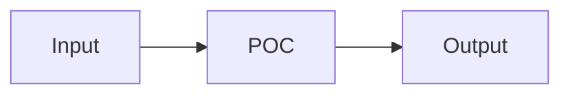

Replace `README.md` with a concise POC README.

The README must contain only:

1. A one-line overview of the idea.
2. A Mermaid diagram showing the POC flow.
3. A `Getting Started` section with clear instructions for how to run, demo, or simulate the POC locally.

Requirements:

- Keep the entire README short and practical.
- Remove marketing copy, background narrative, roadmap text, long feature lists, and generic project boilerplate.
- Infer the overview from the repo's product docs, plan, source code, fixtures, scripts, or tests.
- Infer run and simulation commands from actual project files such as `package.json`, `pyproject.toml`, `Makefile`, scripts, Docker files, or existing docs.
- Do not invent commands, credentials, services, ports, or setup steps that are not supported by the repo.
- If a command is missing but required, include a short `TODO:` note instead of guessing.
- Prefer copy-pasteable commands.
- Include fixture, demo-data, reset, or replay commands only when the repo provides them.
- Mention required environment variables only if they are present in the repo or clearly documented.
- Use simple headings and no extra sections.

Use this structure:

````markdown
# [POC Name]

[One-sentence overview.]

## Flow



## Getting Started

```bash
[commands]
```
````

After replacing the README, stop. Do not modify application code unless the README cannot be made accurate without first fixing an obvious broken command reference.
