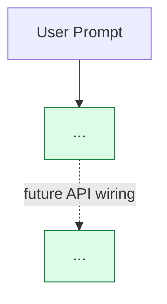
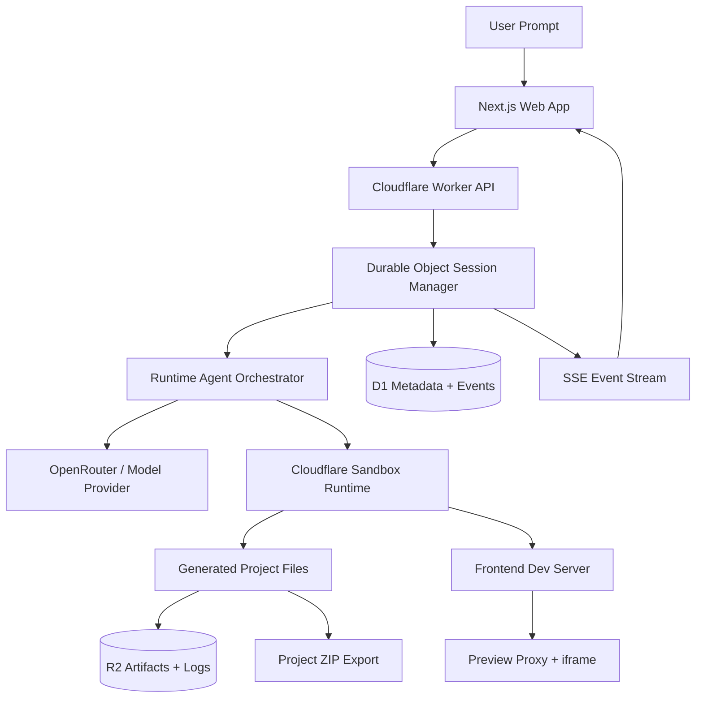

Create or update `CURRENT_STATE.md` as a concise visual snapshot of what is implemented, what is mocked/local-only, and what the future target state should look like.

Use this workflow:

1. Inspect the source of truth first.
   - Read `PRD.md` and find the main Mermaid architecture diagram.
   - Read `PLAN.md` and identify the latest completed phase plus the next incomplete phase.
   - Read `docs/architecture.md` if it exists, especially any architecture diagram or runtime flow.
   - Use `git status --short` to understand uncommitted work that may affect the current state.
   - Use `rg` or targeted file reads to confirm major implemented packages/routes instead of guessing from docs alone.

2. Create two Mermaid diagrams similar in style to the PRD.
   - The first diagram is `Current Architecture Snapshot`.
   - The second diagram is `Future Target Architecture`.
   - Put both diagrams before the `What Is Done` section.

3. Current diagram requirements.
   - Use `flowchart TD` unless the repo already uses another Mermaid style consistently.
   - Show the target system shape, but mark nodes by current status.
   - Include the actual current control-plane pieces, runtime-agent pieces, storage/service pieces, and UI pieces.
   - Use distinct Mermaid `classDef` styles for:
     - done / implemented
     - partial / fixture / local-only
     - future / planned
     - not yet wired / important gap
   - Use dashed arrows for future or not-yet-wired connections.
   - Keep node labels short and concrete.

4. Future diagram requirements.
   - Show the intended production path from prompt submission to generated app preview/export.
   - Use solid arrows for the desired future steady-state flow.
   - Include deployed infrastructure pieces that may not exist yet, such as real model provider, Durable Objects, D1, R2, Cloudflare Sandbox, live event stream, preview proxy, and export packaging.
   - Do not use current-status color classes in the future diagram unless it improves clarity; the future diagram should read as the target architecture, not a progress tracker.
   - Keep the future diagram consistent with `PRD.md`, but update it with known plan decisions such as OpenRouter as the first default model provider if applicable.

5. Separate implementation reality from future architecture.
   - Be explicit when something is real implementation.
   - Be explicit when something is a mock, local test double, fixture, scaffold, or API contract only.
   - Do not imply local mocks are real deployed infrastructure.
   - If a later phase is required for end-to-end behavior, name that phase or capability.

6. Structure `CURRENT_STATE.md` for quick orientation.
   - Start with a title and the latest completed phase.
   - Add a short note explaining that this is a snapshot, not the full PRD.
   - Add `Current Architecture Snapshot` with the status-coded Mermaid diagram.
   - Add `Future Target Architecture` with the intended production-state Mermaid diagram.
   - Add sections:
     - `What Is Done`
     - `What Is Still Mocked Or Local-Only`
     - `Next Critical Phase`
     - `Current Testing Confidence`
   - Keep bullets concise but specific enough to be useful.

7. Verification and final response.
   - For docs-only edits, no tests are required unless the repo has a Mermaid/docs validation command.
   - Read back the created/updated `CURRENT_STATE.md` before finalizing.
   - In the final answer, link to `CURRENT_STATE.md`, summarize what it contains, and mention that tests were not needed for docs-only changes.

Desired `CURRENT_STATE.md` shape:

````md
# Current State: <Product Name>

Last updated after Phase <n>: <phase name>.

<One short paragraph explaining the snapshot.>

## Current Architecture Snapshot



## Future Target Architecture



## What Is Done

- ...

## What Is Still Mocked Or Local-Only

- ...

## Next Critical Phase

- ...

## Current Testing Confidence

...
````

Style requirements:

- Keep it factual and compact.
- Prefer exact package/service names from the repo.
- Avoid marketing language.
- Avoid long architecture essays; this file is for orientation.
- If there is uncertainty, say what you verified and what remains to be checked.
